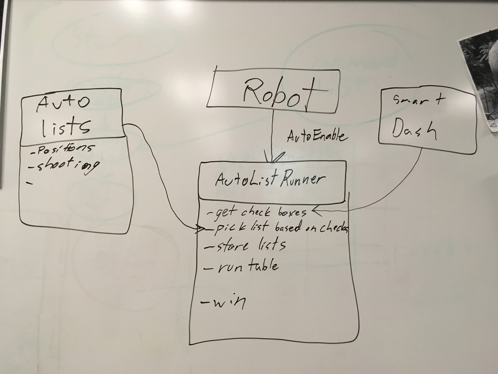
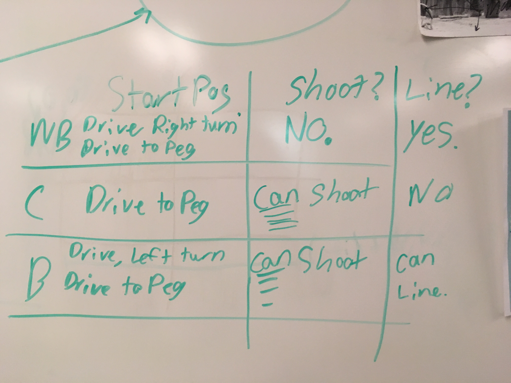
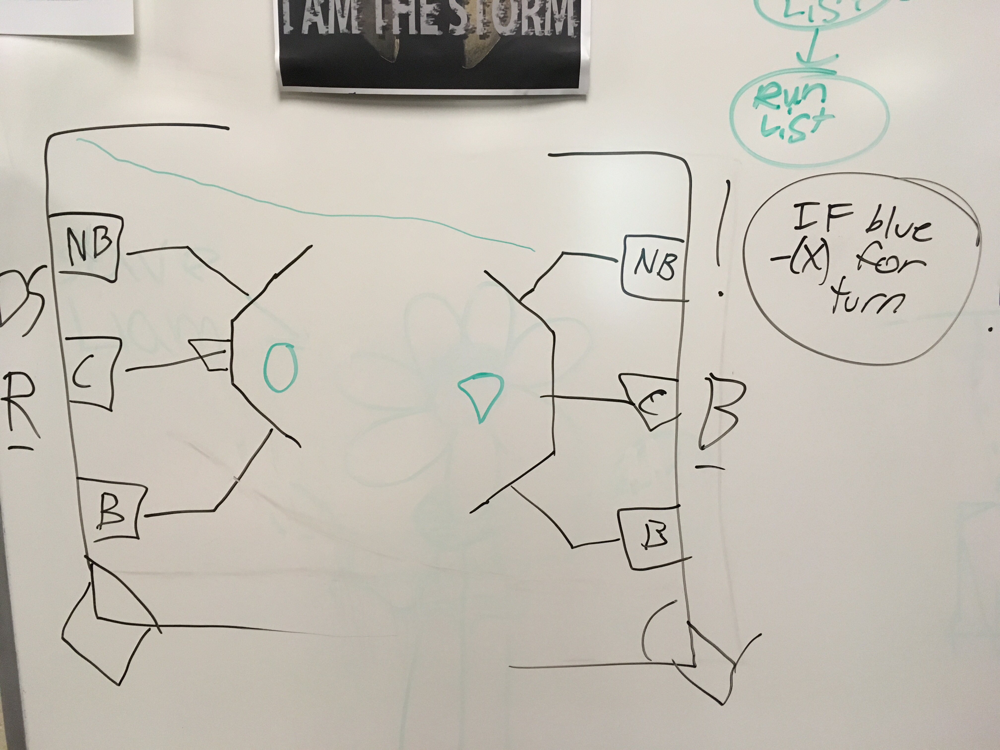
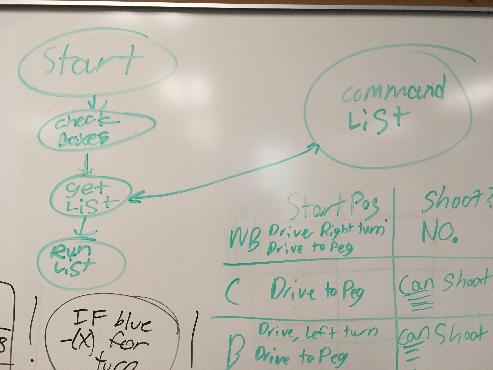

This is the diagram for how the command runner runs in auto.

Some type of selection system (most likely smart dashboard) will choose StartPosition, Shoot or not, and cross the line or not. This chart
shows how we will handle these choices during auto.

This is a reference for starting positions and paths.

This also shows that we will reverse all turns when on the opposite side of the field.

A simple flow for during auto.

During teleop, auto commands will be able to be called by using an auto command runner.
