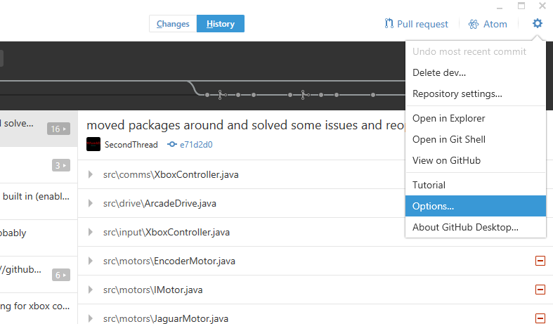
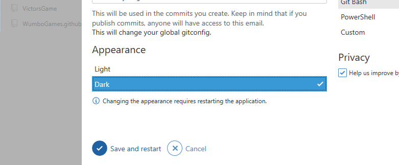
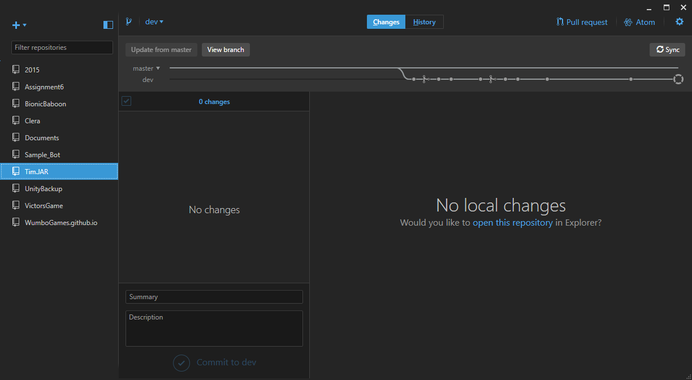
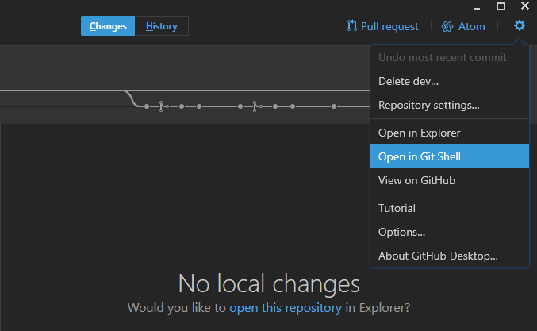
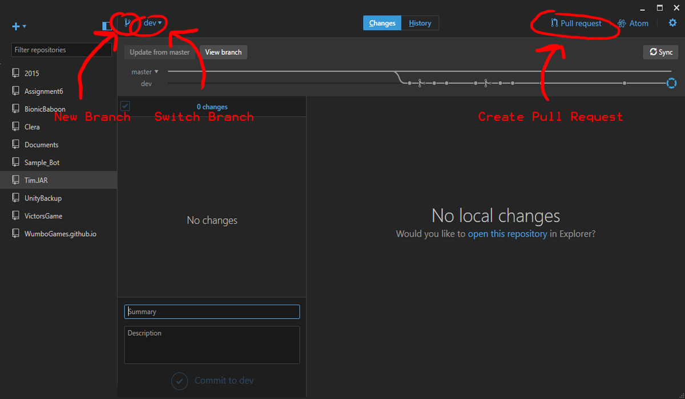

#Github Desktop Installation and Use
------
##Download and installation
First, download Github Desktop installer from <a href="https://desktop.github.com/">the Github Desktop website</a>. If
the application is blocked on the school's WIFI, it is also available on the robotics flash drive.

When you run the application, the following security warning will show up. Click <b>"Install"</b>.
 

 

The application will then download. This may take a while.
 

 

When you open Github Desktop for the first time, you will be asked to sign in with your github account. If you don't
have one, <a href="https://github.com/">make one</a>. Otherwise sign in. After you sign in, a tutorial will show up. That tutorial is stupid and inferior
to this one in all ways, so as soon as you get the option to right click on it and delete it.

___________________________
##Cloning Repositories into Github Desktop
A repository is basically a github project. All the repositories you will ever need for robotics in the foreseeable future
will be located in the <a href="https://github.com/2202Programming">2202Programming organization</a>. The first thing you
need to do to start working on code is cloning the repository (repo for short). Oddly, you have to do this through your
internet browser, not Github Desktop. Click on the repository you want to clone, and then click the <b>"Clone or Download"</b>
button, and then <b>"Open in Desktop"</b>.
 

 

You will probably get some version of the following security warning, which is cool; just say yes or accept of whatever.
 

 

Github Desktop will open and ask you for a place to clone your Repo. I recommend Documents/Github (and keep all your Github
stuff there), but you can do whatever you prefer. Nice job, you're done! Go eat a cookie after all that hard work!

_________________________
##Stopping your eyes from bleeding out
It's a struggle. You just finished the last part of the tutorial, and after your cookie, you have to go get an ice pack and
a cast for your eyeballs because they are about to fall out since you have been staring at the neon-white webpage the past
15 minutes that got its color scheme from the surface of the sun. And now you have to stare at a white background whenever
you use Github! Helllll no!

Hang in there, its just a few hundred thousand more rods and cones that need to die before your eyes are happy. Click on the
<b>gear icon</b> in the top right hand corner of the application, and then on <b>"Options"</b>.
 

 

This will open up the Options panel. Under "Appearance", click on <b>"Dark"</b>, and then on <b>"Save and restart"</b>.
 

 

Github will restart, but this time with a dark color scheme. Ahh... Much better...
 

 

__________________________
##Getting to the Command Prompt
If the first thing you notice about Github Desktop is the amount of time you spend moving your hand from the keyboard to the
mouse and back, this section is for you. Otherwise, skip it. But mice are the bane of productivity. Oh, and User
Interfaces. Those too. Utter waste of time. We must remove this clicky-clicky foolishness immediately.

Click on the <b>gear icon</b> and then on <b>"Open in Git Shell"</b>. If "Open in Git Shell" isn't there, then you have to select
your repository on the left first.
 

 

I think there is a tutorial on how to do everything in command prompt somewhere, but idk where. Sorry! On the bright side you
can do almost everything else you would need to without it. Also, you can change the type of command prompt you have in Options.
I highly recommend Git Bash, but you can do whatever you like.

__________________________
##Branches
Once you have read our documentation about what branches are and why we use them, there are a few things you have to remember.
When you go to write code, everything you do will be in the branch you are in. So if you don't switch out of Master before you
start typing, bad things will happen.

The branch stuff is located on the top left side of the application, by the repositories section. You can create a new branch by
clicking on the new branch icon (go figure) and then naming it and selecting what it is branching from. You can also switch your
branch by clicking on the name of the branch you are currently in and then selecting another one.
 

 

You can also create a pull request by clicking on the pull request tab on the top right and then filling out the prompted
information.
