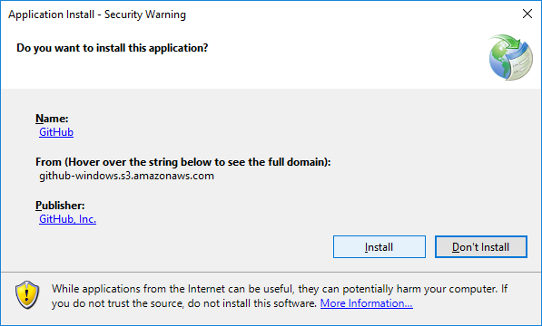
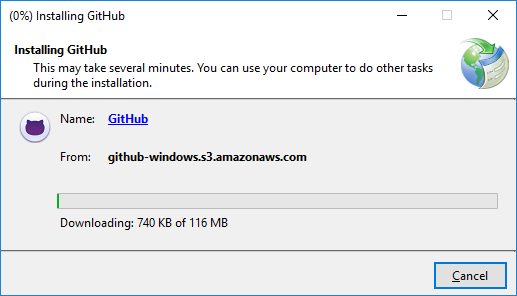
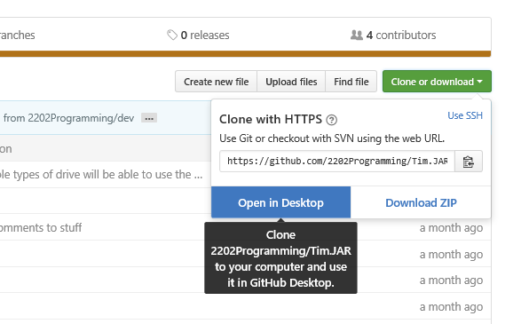
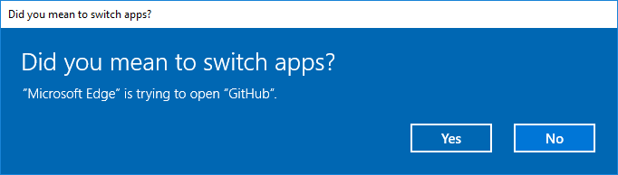

#Github Desktop installation and use tutorial.
------
##Download and installation
First, download Github Desktop installer from <a href="https://desktop.github.com/">the Github Desktop website</a>. If
the application is blocked on the school's WIFI, it is also available on the robotics flash drive.

When you run the application, the following security warning will show up. Click <b>"Install"</b>.

The application will then download. This may take a while.

When you open Github Desktop for the first time, a tutorial will show up. That tutorial is stupid and inferior to this one
in all ways, so as soon as you get the option to, delete it.

___________________________
##Cloning Repositories into Github Desktop
A repository is basically a github project. All the repositories you will ever need for robotics in the foreseeable future
will be located in the <a href="https://github.com/2202Programming">2202Programming organization</a>. The first thing you
need to do to start working on code is cloning the repository (repo for short). Oddly, you have to do this through your
internet browser, not Github Desktop. Click on the repository you want to clone, and then click the <b>"Clone or Download"</b>
button, and then <b>"Open in Desktop"</b>.

You will probably get some version of the following security warning, which is cool; just say yes or accept of whatever.

Github Desktop will open and ask you for a place to clone your Repo. I recommend Documents/Github (and keep all your Github
stuff there), but you can do whatever you prefer. Nice job, you're done! Go eat a cookie after all that hard work!
